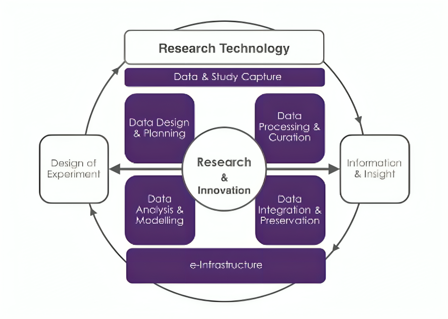

# Research-Data-Management-Framework
A comprehensive repository for managing research data. This framework is designed to facilitate organized, reproducible, and collaborative research workflows. Ideal for researchers looking to maintain a well-structured approach to data handling throughout the lifecycle of their projects.

## Table of Contents

1. [Introduction](#introduction)
2. [Data Cycle Steps](#data-cycle-steps)
   - [Step 1: Design of Experiment](#step-1-design-of-experiment)
   - [Step 2: Data Design and Planning](#step-2-data-design-and-planning)
   - [Step 3: Data Capture (Equipment Phase)](#step-3-data-capture-equipment-phase)
   - [Step 4: Data Processing and Curation](#step-4-data-processing-and-curation)
   - [Step 5: Data Linking and Integration](#step-5-data-linking-and-integration)
   - [Step 6: Data Analysis and Interpretation](#step-6-data-analysis-and-interpretation)
   - [Step 7: Information and Insight Publishing](#step-7-information-and-insight-publishing)
3. [References](#references)
4. [Author](#author)
5. [License](#license)
6. [Intended Audience](#intended-audience)
7. [Supplementary Reading](#supplementary-reading)

## Introduction

Effective data management is critical for ensuring the quality, accessibility, and reusability of research data. This repository outlines the data management cycle based on the principles of **Data Stewardship for Open Science** as described by Barend Mons. Each step in this cycle is crucial for maintaining the integrity and usability of data throughout the research process. It aims to assist researchers, data stewards, and institutions in effectively managing research data following the FAIR (Findable, Accessible, Interoperable, Reusable) principles.

## Data Cycle Steps

### Step 1: Design of Experiment

The first step in the data management cycle is the **Design of Experiment**. During this phase, researchers outline the scientific questions and hypotheses that will guide their study. Proper planning at this stage ensures that the data collected will be relevant and sufficient for the research objectives.

### Step 2: Data Design and Planning

The **Data Design and Planning** phase involves setting up the infrastructure and protocols for data collection, including data formats, metadata standards, and storage solutions. This step is essential to ensure that data will be easily findable, accessible, interoperable, and reusable.

### Step 3: Data Capture (Equipment Phase)

In the **Data Capture** phase, data is collected using various instruments and equipment. This step requires strict adherence to data collection protocols to ensure data quality and consistency.

### Step 4: Data Processing and Curation

The **Data Processing and Curation** stage involves transforming raw data into a usable format. This includes data cleaning, normalization, and validation.

### Step 5: Data Linking and Integration

During the **Data Linking and Integration** phase, different data sources are connected to provide a comprehensive view of the research findings.

### Step 6: Data Analysis and Interpretation

In the **Data Analysis and Interpretation** phase, the processed data is analyzed to extract meaningful insights.

### Step 7: Information and Insight Publishing

The final step is **Information and Insight Publishing**. This phase involves sharing the results and data with the broader scientific community, adhering to the FAIR principles.

3. 

    
References

    - Mons, B. (2021). Data Stewardship for Open Science: Implementing Fair principles. Chapman & Hall/CRC
    

4. 

    
Author

    - **Name:** Ahmad Abu Dayeh, Yu-ting Fu
    - **Affiliation:** Universität zu Köln
    

5. 

    
License

    - 
    

6. 

    
Intended Audience

    - Researchers and data scientists involved in data-intensive research.
    - Data stewards and PIs responsible for managing research data.
    

7. 

    
Supplementary Reading

    - 
    

